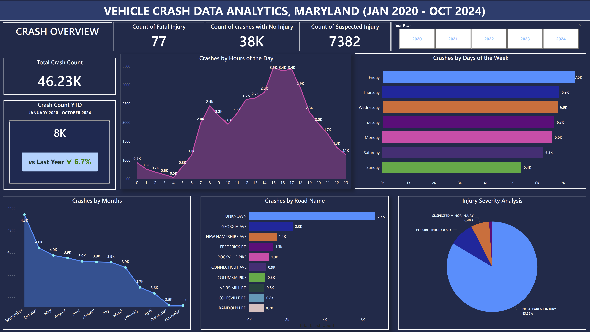
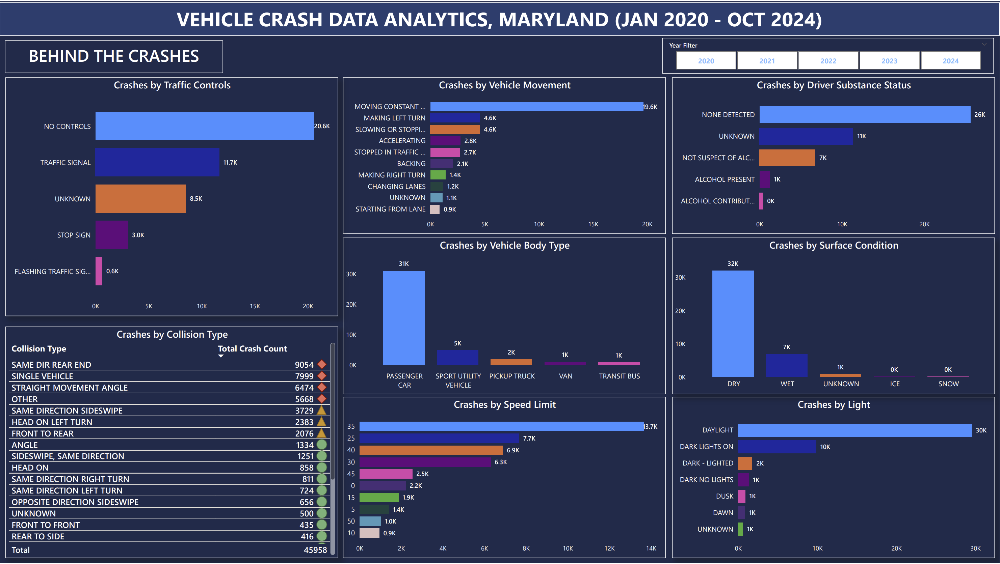

# Maryland Vehicle Crash Data Analytics (Power BI)

### Project Overview
An in-depth analysis of 46,000+ unique vehicle crashes in Maryland 
(January 2020 - October 2024) using Power BI. This project uncovers 
surprising root causes behind Maryland road crashes, challenges common 
assumptions and delivers actionable road safety recommendations.

### Dashboard Preview
### Page 1 — Crash Overview

### Page 2 — Behind the Crashes

### Dataset
| Version | Download |
|---------|----------|
| **Raw Data** | [Download Raw Dataset](https://drive.google.com/file/d/1CEgXfwrb68FMdkcVuyVXrW46zvXtegKc/view?usp=drive_link)|
| **Cleaned Data** | [Download Cleaned Dataset](https://drive.google.com/file/d/1H7pquIFKPL1n2yuEzOUYw3hic3tg0tm6/view?usp=drive_link) |

> Raw data was cleaned and transformed using Power Query 
> before analysis. Cleaning steps are embedded in the .pbix file.
### Tools & Technologies
- **Power BI** — Dashboard and visualizations
- **Power Query** — Data cleaning and transformation
- **DAX** — Measures and calculations
- **Data Modelling** — Relationships and date table

### Project Stages
1. **Data Collection** — Maryland crash reporting dataset
2. **Data Cleaning** — Power Query transformations
3. **Data Transformation** — DAX measures and date intelligence
4. **Data Modelling** — Relationships between tables
5. **Dashboard Generation** — Interactive Power BI visuals

### Key Findings
What if everything you assumed about vehicle crashes was wrong?

| Assumption | Reality |
|------------|---------|
| Bad weather causes crashes | 70% happened in **clear dry conditions** |
| Night driving is dangerous | **Daylight** had highest crashes |
| Drunk driving is main cause | Majority had **no substance detected** |
| Overspeeding causes crashes | Most happened at **35mph** |

### Root Cause
**Traffic Management** is the real cause:
- 21K crashes at locations with **no traffic controls**
- Peak hours **3PM - 5PM**
- **Fridays** most dangerous day
- **Same Direction Rear End** highest collision type
- **Moving Constant Speed** highest vehicle movement

### Recommendations
1. Investigate top roads with highest crashes and no traffic controls
2. Install traffic signals at high crash locations
3. Construct speed breakers on high crash roads
4. Increase traffic enforcement during **3PM-5PM on Fridays**

### How to Open
1. Download **Power BI Desktop** (free) from microsoft.com
2. Clone or download this repository
3. Open the **.pbix file** in Power BI Desktop
4. Interact with the dashboard using year slicer ✅

### Connect With Me
- **LinkedIn:** [https://www.linkedin.com/in/victor-olatunji-b62a6a3bb/]
